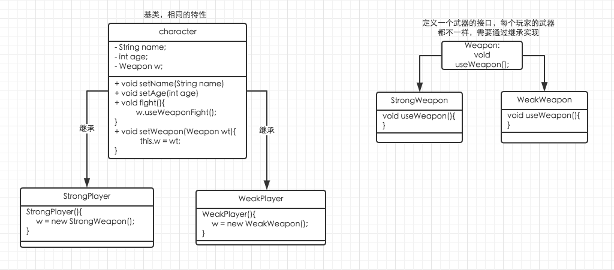

面向对象的编程不可避免的需要使用到各种各样的设计模式，设计模式可以使得代码更优雅，变得更加有弹性，设计模式带来的好处不需要再多说了，作者原先写的是Lua代码，函数式编程语言，没有很强的面向对象，因此很少会使用到设计模式。

最近开始接触Java的游戏服务端，发现里面的代码虽然看得懂，但是总是很难理解，不知道其为什么这样设计，后面慢慢发现里面运用到了很多设计模式，为了更好的理解代码，作者开始学习设计模式，在此记文。

首先接触到的是策略模式，我会用自己的理解来写一个简单的例子，就不说很多理论了。我发现大学时读过的设计模式，那个时候觉得应用性不足，因为看了觉得很有道理，但是很难联想其应用场景，老是会有疑问，这个到底用在哪里。但是当做过的项目多了之后，这些疑问就会得到解决，因为在做项目过程中你会遇到很多问题，然后你会发现恰当的设计模式能很好的解决你这个问题，这个时候你才会觉得前人总结的设计模式的伟大之处。

那么什么是策略模式呢？
```
        策略模式定了算法族，分别封装起来，让它们之间可以互相替换，
        此模式让算法的变化独立于使用算法的客户。
```
这是非常官方的描述，单独看这个描述肯定一头雾水，当然我不打算去解释这个定义，我只是简单谈一下我对策略模式的运用，至于完不完全符合策略模式就看实际情况的运用了，理论只是起指导作用，我觉得不可生搬硬套。

当我们需要设计一个类的时候，我们总是需要去思考这个类哪些属性是不需要改变的，哪些属性是需要动态变化的，不需要改变的通常是对象共有的属性，需要变化的则是对象的个性化，这在生活中很常见，我们总是拥有某些共性的同时，保留自己的个性。

让我们假设一个场景，游戏中玩家需要战斗，战斗需要武器，每个玩家是一个个体，你会很容易发现这里的共性是玩家的基本属性，如姓名、年龄等，行为共性则是战斗，玩家都需要战斗，但是战斗使用的武器是不一样的，每个玩家的都不一样，同一个玩家也可能换武器，因此设计的时候不能把武器的实现与玩家绑死。

下面是设计的类图：


实现代码例子为：
```java
//Character.java
package com.base;

//玩家战斗不变的基础属性独立出来的超类，可复用
public class Character {
    //玩家的共有的属性
    private String name;
    private int age;
    
    //Weapon是一个接口
    protected Weapon w;
    
    public String getName(){
        return name;
    }
    
    public void setName(String name){
        this.name = name;
    }
    
    public int getAge(){
        return age;
    }
    
    public void setAge(int age){
        this.age = age;
    }
    
    //可以动态的改变武器
    public void setWeapon(Weapon wt){
        this.w = wt;
    }
    
    //玩家都是使用武器战斗，但不同玩家拥有不同的武器
    public void fight(){
        w.useWeaponFight();
    }
    
}
```

Character是一个超类，通过继承Character实现每个玩家类，你会发现Character的变量成员和方法都没有被绑死，拿fight()方法来谈，不管w接口由谁实现，反正这里调用的就是useWeaponFight()方法，使用武器进行战斗，战斗是每个玩家都必须具备的，这个在这个场景下永远不会改变，同时还提供:
```java 
setWeapon(Weapon wt) 
```
方法，可以动态改变武器，玩家也不会和武器类绑死，这样设计类代码可以具备足够的弹性。

下面其它类的简单实现：
```java
//Weapon.java
package com.base;

//武器接口，通过实现该接口产生不同的武器
public interface Weapon {
    public void useWeaponFight();
}

```

```java
//StrongWeapon.java
package player;
import com.base.Weapon;

//实现一个强力武器
public class StrongWeapon implements Weapon{
    public void useWeaponFight(){
        System.out.println("Use Strong Power Weapon Fighting!");
    }
}

```

```java
//StrongPlayer.java
package player;
import com.base.Character;
//产生一个玩家，玩家的武器初始化在构造器中
public class StrongPlayer extends Character{
    public StrongPlayer(){
        this.w = new StrongWeapon();
    }
}
```

```java
//WeakWeapon.java
package player;
import com.base.Weapon;

//实现一个弱势武器
public class WeakWeapon implements Weapon{
    public void useWeaponFight() {
        System.out.println("Use Weak Weapon Fighting!");
    }
}

```

```java
//WeakPlayer,java
package player;
import com.base.Character;

public class WeakPlayer extends Character{

    public WeakPlayer() {
        this.w = new WeakWeapon();
    }
}

```

然后我们来测试一下两个玩家类，测试代码为：
```java
//StartFight.java
import player.*;

public class StartFight {
    public static void main(String[] args){
        StrongPlayer sp = new StrongPlayer();
        sp.fight();
        
        WeakPlayer wp = new WeakPlayer();
        wp.fight();
        
        //切换武器
        sp.setWeapon(new WeakWeapon());
        sp.fight();
        
        //切换强力的武器
        wp.setWeapon(new StrongWeapon());
        wp.fight();
    }
}

```

输出结果：
```java
Use Strong Power Weapon Fighting!
Use Weak Weapon Fighting!
Use Weak Weapon Fighting!
Use Strong Power Weapon Fighting!
```

上面只是一个简单的例子，回到策略模式的定义，这里所谓的封装的算法族体现为每个武器类，每个武器类的使用武器的方法useWeaponFight()都是不一样的，这个算法是可以变化的，比如StrongWeapon，假设现在需求改变了该武器的使用方法，那么我们只需要修改StrongWeapon的useWeaponFight()方法就可以了，原来的代码都不用修改，这样就达到了我们设计良好代码的目的啦。

以上为策略模式简单谈的全部内容，接下来会继续学习其他设计模式，也会继续和大家分享，该案例的工程代码也上传至github，有兴趣的同学可以继续扩展。https://github.com/huchangwei/StrategyMode


